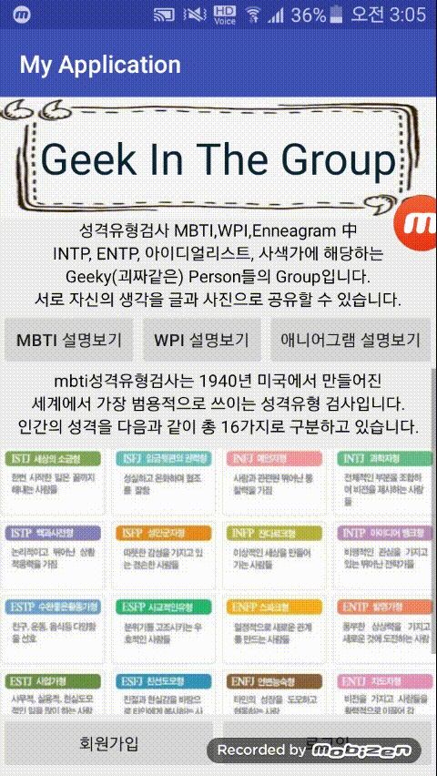
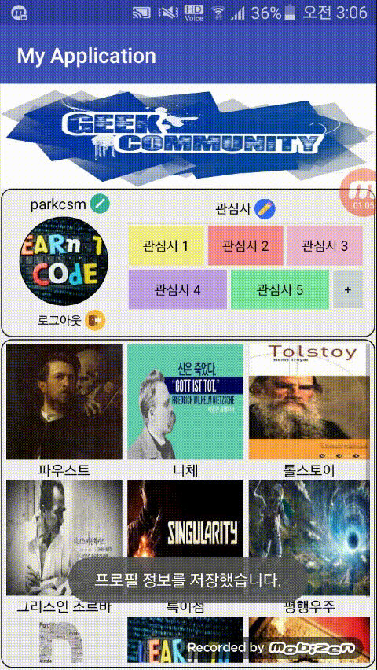
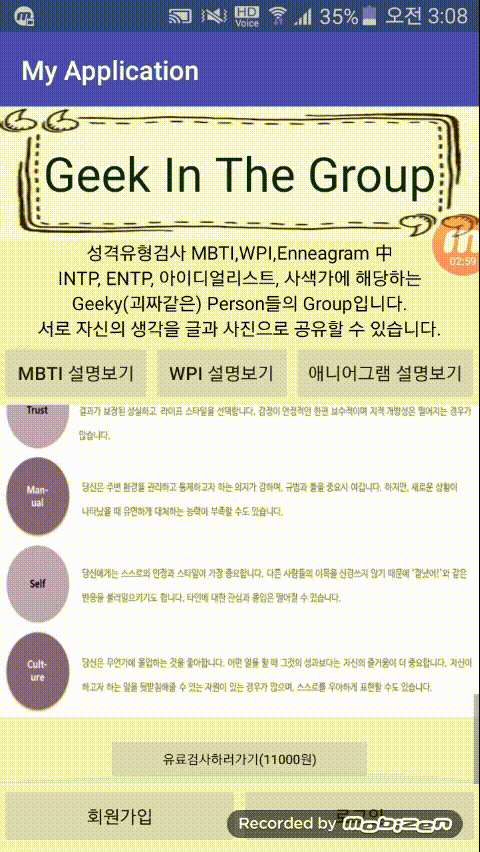
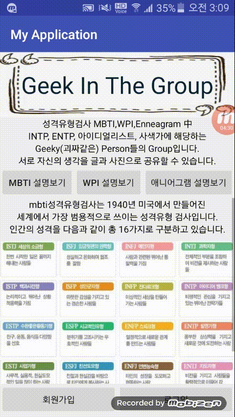

 **작품 플레이 영상**
=======================================

**만들게 된 계기 및 간단 소감**
=======================================
1. 6주정도의 시간동안 만들었음. 
2. 처음 Android을 배워서 만든 작품. 
3. 개발 기잔 :2018년 3월 ~ 2018년 4월 
4. 자바를 배우고 이어서 안드로이드를 배웠는데, Manifest, ListView, Xml의 개념, Listener의 개념, HashMap의 개념등이 신선하게 다가왔다. 처음 접하는 안드로이드 스튜디오를 이리저리 만져보느라 고생 좀 했다.

**기능 소개**
======================================
1. 회원가입
2. 로그인
3. 프로필 수정
4. 사진 첨부해서 게시글 댓글 남기기 (추가, 수정, 삭제)
5. 주제 별로 만들 수 있는 다양한 게시판
